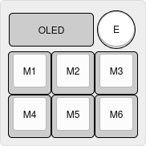

# LK7D 7 Keys Macropad

The LambdaKB LK7D is a simple 7 keys hotswap macropad with per-key RGB LEDs and an OLED display. The goal was to create a simple macropad based on the XIAO RP2040 microcontroller that had all the bells and whispers of a modern keyboard.

This was created as an experiment to learn more about designing PCBs and to have a simple and cheap way to test new features (such as integrating OLED displays and RGB LEDs in QMK / Vial).

## Layout

[Keyboard Layout Editor](https://www.keyboard-layout-editor.com/##@_css=.keyborder%5Bstyle*%2F=%22%23ff0000%22%5D%20%7B%0A%20%20%20%20border-radius%2F:%2050%25%20!important%2F%3B%0A%20%20%20%20background-color%2F:%20%23ccc%20!important%2F%3B%0A%7D%0A.keytop%5Bstyle*%2F=%22%23ff4223%22%5D%20%7B%0A%20%20%20%20border-radius%2F:%2050%25%20!important%2F%3B%0A%20%20%20%20background-color%2F:%20%23fff%20!important%2F%3B%0A%7D%3B&@_x:2&c=%23ff0000&p=CHICKLET&a:7%3B&=E%3B&@_y:-0.9&c=%23cccccc&p=FLAT&w:2&h:0.8%3B&=OLED%3B&@_y:-0.10000000000000009&p=R1%3B&=M1&=M2&=M3%3B&@=M4&=M5&=M6)

## PCB

|             Front             |            Back             |
| :---------------------------: | :-------------------------: |
| [![PCB Front]][PCB Front PNG] | [![PCB Back]][PCB Back PNG] |

[PCB Front]: output/pcb/img/lk7d-pcb-top.svg
[PCB Front PNG]: output/pcb/img/lk7d-pcb-top.png
[PCB Back]: output/pcb/img/lk7d-pcb-bottom.svg
[PCB Back PNG]: output/pcb/img/lk7d-pcb-bottom.png

The PCB has been designed in [KiCad EDA 9.0](https://www.kicad.org/) using the [`kicad-lkbd`](https://github.com/lambdakb/kicad-lkbd) libraries.

You can preview the project files using [KiCanvas](https://kicanvas.org/?github=https%3A%2F%2Fgithub.com%2Flambdakb%keyboard-lk7d%2Fblob%2Fmain%2Fpcb%2Flk7d-pcb.kicad_pro) directly in your browser and download the latest fabrication files for JLCPCB from the [latest release](https://github.com/lambdakb/trackball-lk7d/releases/latest/).

The exported schematic is also available under [`output/schematics`](output/schematics/).

### PCB Order

| Parameters                       | Value                  |
| -------------------------------- | ---------------------- |
| Base Material                    | FR4                    |
| Layers                           | 2                      |
| Dimensions                       | 57.15 × 57.15 mm       |
| PCB Thickness                    | 1.6 mm                 |
| PCB Color [^pcb-color]           | Black                  |
| Silkscreen                       | White                  |
| Surface Finish [^surface-finish] | Lead Free HASL or ENIG |
| Copper Weight                    | 1 oz                   |
| Via Covering                     | Tented                 |
| Min Via Hole Size                | 0.3 mm                 |
| Board Outline Tolerance          | ± 0.2 mm               |

[^pcb-color]: You can select any PCB color you want but some manufacturers such as JLCPCB may charge you more for uncommon combos (such as Blue PCB + ENIG Surface Finish).
[^surface-finish]: The "HASL (with lead)" option is extremely discouraged due to the risk of lead poisoning. We strongly recommend paying the premium for the "Lead Free HASL" option.

### BOM

| Part                     | Ref.                                                | Quantity | Optional | Remarks                                                                                                                                                   |
| ------------------------ | --------------------------------------------------- | :------: | :------: | --------------------------------------------------------------------------------------------------------------------------------------------------------- |
| PCB                      | [LK7D PCB](./pcb/)                                  |    1     |    ❌    | The PCB itself.                                                                                                                                           |
| XIAO RP2040 Controller   | [SeeedStudio XIAO RP2040]                           |    1     |    ❌    | Main controller for QMK/Vial.                                                                                                                             |
| 1N418 Diodes             | [1N4148W T4 SOD-323]                                |     7     |    ❌    | Switch matrix diodes. One MUST be installed under the encoder.                                                                                            |
| Kailh Hot-Swap Sockets   | [CPG151101S11-16]                                   |    6     |    ❌    | MX style hot-swap sockets.                                                                                                                                |
| Key Switches             | Any [Cherry MX] Compatible Switch                   |    6     |    ❌    | MX style switches.                                                                                                                                        |
| Rotary Encoder           | Any [EC11] / [EC12] style 5-pin Encoder             |    1     |    ❌    | Can be installed either in top left or top right of the PCB. Only one per PCB is supported.                                                               |
| 100nF Capacitor          | [1206 SMD Ceramic Capacitor]                        |   2-3    |    ✅    | Both C1 and C2 should be installed if populated, used for noise filtering of encoder readings. C3 is only required if a Logic Level Shifter is installed. |
| 0.91" OLED Display       | [SSD1306 0.91" 128X32 OLED I²C Display Module]      |    1     |    ✅    | Optional, occupies the place of the non-populated encoder and sits on top of the XIAO MCU.                                                                |
| RGB LEDs                 | [SK6812MINI-E]                                      |    6     |    ✅    | Optional, RGB LEDs can be installed under each key switch.                                                                                                |
| 5V Logic Level Converter | [SN74AHCT1G125DBVR] or [SN74LV1T125DBVR] (SOT-23-5) |    1     |    ✅    | Optional, required if your RGB LEDs are not 3.3V logic tolerant. You MUST cut the JP1 jumper if populated.                                                |

[SeeedStudio XIAO RP2040]: https://www.seeedstudio.com/XIAO-RP2040-v1-0-p-5026.html
[1N4148W T4 SOD-323]: https://www.aliexpress.com/item/1005006127619725.html
[CPG151101S11-16]: https://www.aliexpress.com/item/1005007052649640.html
[Cherry MX]: https://www.aliexpress.com/item/1005006255961111.html
[EC11]: https://www.aliexpress.com/item/32382989585.html
[EC12]: https://www.aliexpress.com/item/1005005196870256.html
[1206 SMD ceramic capacitor]: https://www.aliexpress.com/item/32966490820.html
[SSD1306 0.91" 128X32 OLED I²C Display Module]: https://www.aliexpress.com/item/32777216785.html
[SK6812MINI-E]: https://www.aliexpress.com/item/1005006473087141.html
[SN74AHCT1G125DBVR]: https://www.aliexpress.com/item/1005005379322968.html
[SN74LV1T125DBVR]: https://www.digikey.com/en/products/detail/texas-instruments/SN74LV1T125DBVR/4555571

## Case

Coming soon.

## Firmware

Firmware has been built using [Vial](https://get.vial.today/), a fork of [QMK](https://qmk.fm) allowing configuration through a nice GUI.

Details coming soon.

## License

This design is licensed under the [CERN Open Hardware Licence Version 2 – Strongly Reciprocal (CERN-OHL-S-2.0)](https://opensource.org/license/cern-ohl-s).

You are free to use, modify, and distribute this design for any purpose, provided that:

- **Attribution**: Appropriate credit is given, a link to the license is provided, and any modifications are clearly indicated.
- **Reciprocity**: Any derivative works must be released under the same license.

If you are a retailer or business interested in producing or selling this design or related products, I’d love to discuss it! Please feel free to reach out so we can explore potential arrangements.
